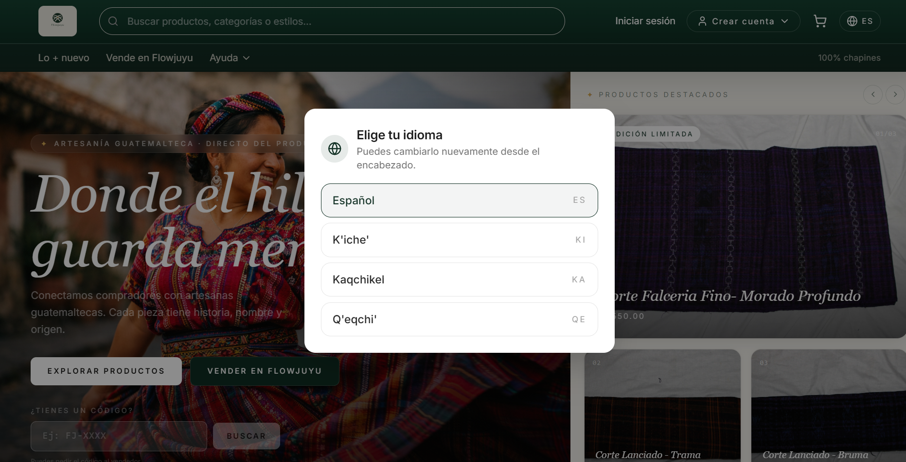
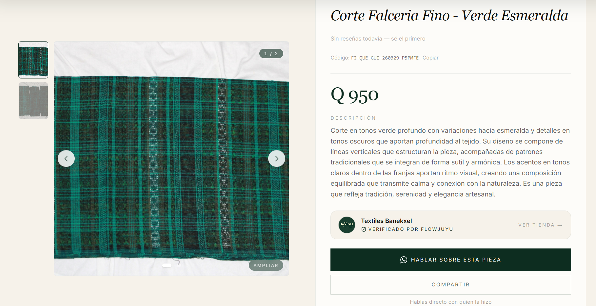

# Cortes Marketplace Frontend

Frontend de un marketplace digital para productos textiles y comercios, construido con Next.js, TypeScript y Tailwind CSS.

Este proyecto representa la interfaz principal del marketplace: permite mostrar productos, explorar tiendas, administrar productos desde el panel del vendedor y conectar la experiencia visual con el backend de Flowjuyu.

## Preview

> Agrega aquí capturas del proyecto para que las personas puedan ver rápidamente cómo luce la plataforma.

### Home / Marketplace



### Product Detail



## Tools and Technologies Used

Este proyecto fue construido utilizando herramientas modernas para desarrollo frontend, diseño responsivo, validación de datos y manejo de estado.

### Core Technologies

- **Next.js** — Framework principal para construir la aplicación frontend.
- **React** — Librería usada para crear componentes reutilizables e interfaces interactivas.
- **TypeScript** — Tipado estático para mejorar la seguridad y mantenimiento del código.
- **Tailwind CSS** — Sistema de estilos utilizado para construir una interfaz responsive y moderna.

### UI and Design

- **shadcn/ui** — Componentes base para construir una interfaz limpia, reutilizable y consistente.
- **Tailwind CSS** — Utilizado para layouts, espaciado, responsive design y estilos visuales.
- **dnd-kit** — Librería utilizada para funcionalidades de drag and drop cuando la interfaz lo requiere.

### State Management and Validation

- **Zustand** — Manejo de estado global de forma simple y ligera.
- **Zod** — Validación de datos y esquemas para formularios y estructuras del frontend.
- **React Hooks** — Manejo de lógica reutilizable dentro de componentes.

### Internationalization

- **next-intl** — Preparación para manejo de traducciones e internacionalización.

### Development Tools

- **npm** — Instalación y administración de dependencias.
- **Git / GitHub** — Control de versiones y publicación del repositorio.
- **Vercel** — Plataforma recomendada para despliegue del frontend.

## Main Features

### Marketplace Interface

- Página principal para mostrar productos destacados.
- Diseño visual enfocado en productos textiles.
- Cards de productos con imagen, nombre, precio y datos relevantes.
- Estructura preparada para mostrar tiendas, vendedores y productos destacados.

### Seller Experience

- Panel para vendedores.
- Vista de productos publicados.
- Flujos para crear y editar productos.
- Interfaz pensada para que un vendedor pueda administrar su catálogo de forma simple.

### Product Management UI

- Formularios para crear y editar productos.
- Campos visuales para información del producto.
- Soporte para imágenes de producto.
- Organización de datos como nombre, precio, descripción, categoría, región, tela y stock.
- Preparado para integrarse con backend mediante endpoints REST.

### Responsive Design

- Diseño adaptable a dispositivos móviles y escritorio.
- Componentes reutilizables.
- Layouts construidos con Tailwind CSS.
- Enfoque mobile-first para mejorar la experiencia en teléfonos.

## Frontend Architecture

El proyecto está organizado para mantener una estructura clara y escalable:

```plaintext
components/
config/
hooks/
lib/
types/
utils/